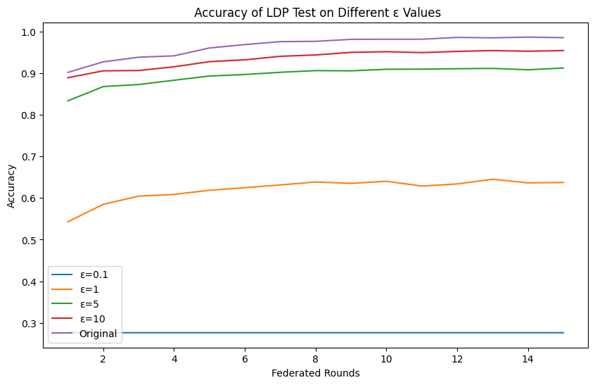

# Security and Privacy --GroupN  
__This repository is the assignment of ELEC0138 Security and Privacy, UCL__   

## 1. DEFINING A THREAT MODEL AND A SECURITY
### Introductions:
Series of significant threats to public transportation systems are caused by the cyber attacks, disrupting operations and compromising passenger safety. These attacks can target infrastructure and IOT devices, or passengers' devices such as signaling systems, camera, speaker, mobile phones, and ticketing platforms, leading to service outages, delays, and potential accidents. By exploiting vulnerabilities in network security, hackers can gain unauthorized access to transportation systems, manipulate schedules, and even hijack aircrafts remotely. The consequences of the attacks will cause the economic damages, public trust, and harm to passengers.

Since all the attacks are simulated, the traffic will be captured using the Wireshark, they will be saved in pcacp file. These files have been converted to CSV format to facilitate their integration with machine learning in the second part, where these packets are used as the validation dataset.

### Types of attacks:
- DOS
- DDOS
- Spoofing
- Botnet attacks
- Hijacking
- Trojan Horse attacks

### Formatting the datasets

## 2. SECURITY/PRIVACY MITIGATIONS
### System: Intrusion Detection and Attack Classification
### Description:
- Utilized datasets from the [CICIoT2023](https://www.unb.ca/cic/datasets/iotdataset-2023.html) dataset, or generated datasets if needed.
- Trained various ML and DL models for intrusion detection and classification. including RF, CNN, LSTM, GRU, and a hybrid CNN+BiLSTM
- Deployed models on the [Flower Framework](https://flower.ai/) to implement Federated Learning (FL).
- Introduce Local Differential Privacy(LDP) to provide privacy guarantees at the individual user level before any data aggregation or analysis occurs.

### Models:  
- RF: n_estimator=100
- CNN:   
  
- LSTM:   
  
- CNN + BiLSTM
- GRU

### Results:  
1. __Model Test:__  
During model training, various features were extracted from network flow data.   
These models achieved exceptional performance with accuracy, precision, recall, and F1-score with a macro accuracy over 95%.
2. __FL Training:__   
The loss reduced from 0.065 to 0.109, and the accuracy improved from 81.05% to 95.86%.

3.__Different levels of LDP:__


### Code Instruction:   
__Data Manipulation:__
```python
# Aggregate the data and reduce the package size
python CW2/code/data manipulation/data_aggregation.py

# Group the data: eg. 'DDoS-SYN_Flood'->'DDoS', 'DNS_Spoofing'->'Spoofing'
python CW2/code/data manipulation/data_group_and_eda.py

# filter the needed classes and sample a balanced data, the processed data will be stored under /datasets folder  
python CW2/code/data manipulation/data_filter.py
```
__Train the Model:__
```
python CW2/code/classifiers/RF_classifier.py   
python CW2/code/classifiers/CNN_classifier.py
python CW2/code/classifiers/LSTM_classifier.py
```

__Train the Model through FL:__  
```python
# First run the server, set the server address correctly (default: 0.0.0.0:8080)
python CW2/code/FL/server.py

# Then run the client, at least 2 clients to start training.
# (default connected server address: 127.0.0.1:8080)
python CW2/code/FL/client.py
```

Simulation can be accessed here: [](https://colab.research.google.com/drive/1kbpPHU2B1tlXQX1mixUxZ4PE2nTpAJWm?usp=sharing)

